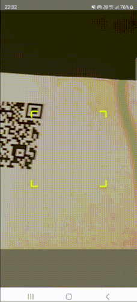

# React Native Modern QR Scanner


[](https://www.npmjs.com/package/react-native-modern-qrscanner)
[](https://www.npmjs.com/package/react-native-modern-qrscanner)
[](https://coveralls.io/github/calintamas/react-native-modern-qrscanner?branch=main)
[](https://github.com/prettier/prettier)


A powerful and customizable QR code scanner component for React Native applications.

## Features

- Advanced QR code scanning capabilities using React Native Camera.
- Customizable scanning viewfinder and overlay.
- Supports both iOS and Android platforms.
- Provides hooks for various QR code scanning events.


## Demo





## Installation
x
```bash
npm install react-native-modern-qrscanner
```

or

```bash
yarn add react-native-modern-qrscanner
```

## Usage

Import `ModernQRScanner` and use it in your React Native application.

```javascript
import { ModernQRScanner } from 'react-native-modern-qrscanner';

// Example usage
<ModernQRScanner
  onRead={(e) => console.log('QR code detected:', e)}
  // other props
/>
```

## Props

- `onRead`: Callback function invoked when a QR code is detected.
- `renderTopView`: Custom render function for the top overlay view.
- `renderBottomView`: Custom render function for the bottom overlay view.
- `rectHeight`, `rectWidth`: Dimensions for the scanning area.
- `flashMode`: Enable or disable the camera flash.
- `finderX`, `finderY`: Position offsets for the scanning viewfinder.
- ...and more.

## Customization

You can customize the scanner viewfinder, overlay styles, and more using the available props.

## License

This project is licensed under the MIT License.

## Contributing

Contributions are welcome. Please read the contributing guide for more details.
